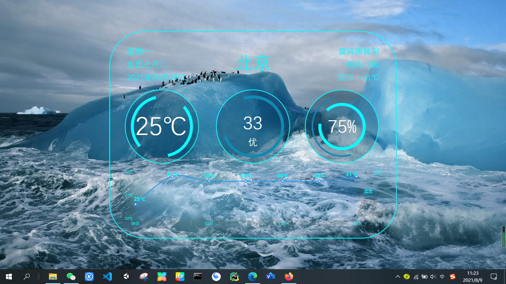
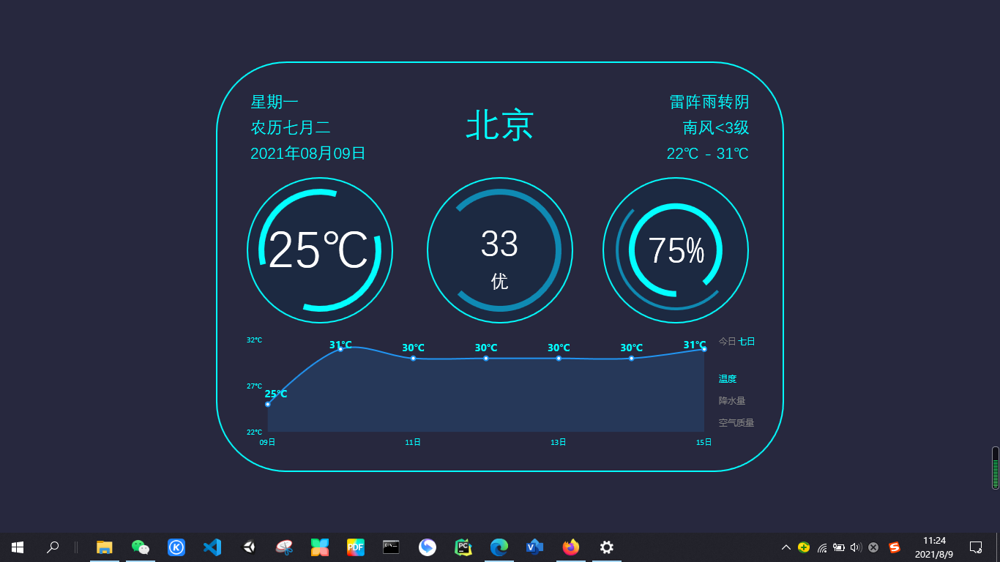

## 欢迎来到xtao的主页

在这里，我将分享一些有趣的自制软件，欢迎下载！

## 1. 天气小助手

一款用于Windows（7，8，10）平台的桌面工具软件，用于实时获取近期天气情况，并在桌面底层可视化展示。





### 软件特色

- C#
- 定时更新天气状态，并可视化展示
- 自定义国内所有城市
- 动态显示24小时/7日内的天气信息
- 在桌面壁纸与桌面图标之间的层上显示

### 注意事项

- **代码开源，绝对无毒，请先设置白名单后，再点击运行**。
由于软件显示于桌面壁纸与桌面图标之间的层，需要调用系统底层API，从而导致“Windows安全中心”和“360安全管家”等软件识别为病毒，请将其设置为白名单后，在启动运行。
- 白名单设置方法：
  [Windows安全中心白名单设置方法](https://support.microsoft.com/zh-cn/windows/%E5%B0%86%E6%8E%92%E9%99%A4%E9%A1%B9%E6%B7%BB%E5%8A%A0%E5%88%B0-windows-%E5%AE%89%E5%85%A8%E4%B8%AD%E5%BF%83-811816c0-4dfd-af4a-47e4-c301afe13b26)
  [360安全管家白名单设置方法](https://jingyan.baidu.com/article/fb48e8be6b1ccd2e632e1432.html)
- 软件以管理员运行

You can use the [editor on GitHub](https://github.com/Taotaoxu/xtao.github.io/edit/gh-pages/index.md) to maintain and preview the content for your website in Markdown files.

Whenever you commit to this repository, GitHub Pages will run [Jekyll](https://jekyllrb.com/) to rebuild the pages in your site, from the content in your Markdown files.

### Markdown

Markdown is a lightweight and easy-to-use syntax for styling your writing. It includes conventions for

```markdown
Syntax highlighted code block

# Header 1
## Header 2
### Header 3

- Bulleted
- List

1. Numbered
2. List

**Bold** and _Italic_ and `Code` text

[Link](url) and 
```

For more details see [GitHub Flavored Markdown](https://guides.github.com/features/mastering-markdown/).

### Jekyll Themes

Your Pages site will use the layout and styles from the Jekyll theme you have selected in your [repository settings](https://github.com/Taotaoxu/xtao.github.io/settings/pages). The name of this theme is saved in the Jekyll `_config.yml` configuration file.

### Support or Contact

Having trouble with Pages? Check out our [documentation](https://docs.github.com/categories/github-pages-basics/) or [contact support](https://support.github.com/contact) and we’ll help you sort it out.
